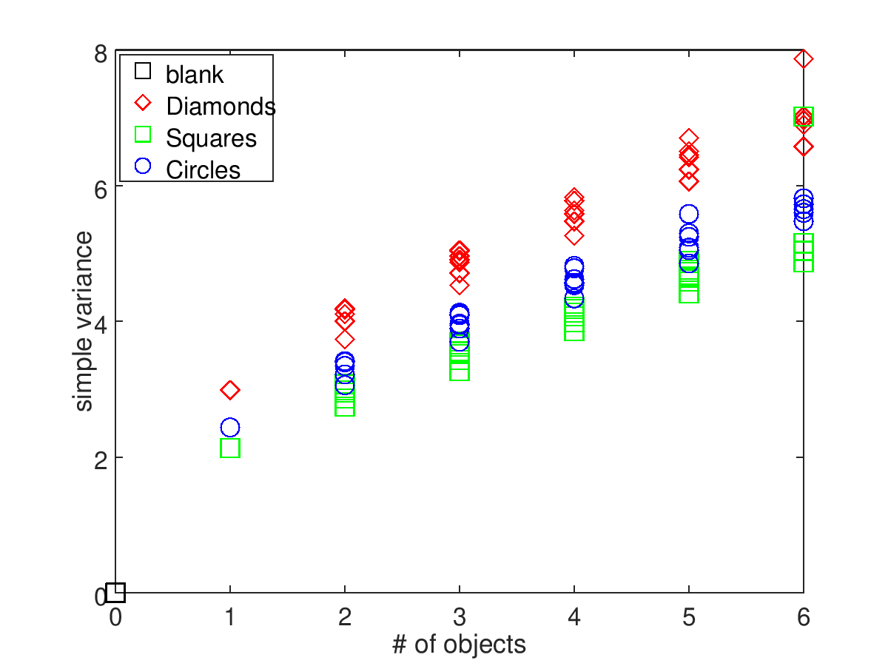

# bee_variance
Exploring questions raised by bees and zero: DOI: 10.1126/science.aar4975

"Could bees do what they do in this paper without counting?" 
> Yes, I think they could show the same behavior without any counting, or understanding of "greater-than", "less-than", or zero.

# Requirements:

- [Supplemental Data PDF](http://science.sciencemag.org/highwire/filestream/711185/field_highwire_adjunct_files/0/aar4975_Howard_SM.pdf) (PDF link, 2.2Mb) from the Howard _et al._ paper
- [pdfimages](https://en.wikipedia.org/wiki/Pdfimages)
- [GNU Octave](https://www.gnu.org/software/octave/)
- [Octave-image toolkit](https://octave.sourceforge.io/image/)
- [convert](https://imagemagick.org/script/convert.php) from Imagemagick

# Howto:

Download the data PDF from the link above, run the bash script on it, then run the Octave script.
If all is well, it should reproduce this graph:

# Discussion:

My motivations for exploring this are: first, the  feeling that I was seeing some equivocation in the first few sentences of the paper—in my opinion the authors overreach in grouping a diverse range of concepts and behaviors into a narrow spectrum they call "Understanding of Zero". Second, going by the perspective explained in e.g. Stephen Budiansky's "If a Lion Could Talk" (that of positing the simplest cognitive mechanisms consistent with the data), it seemed like the behavior displayed by the bees could be explained by simpler mechanisms than actual counting. After reading the paper, my impression was not only that bees probably did not understand the concept of numeric zero, but the entire counting paradigm put forward by these researchers might not be the best way of explaining what's going on.

The researchers took pains to equalize the target stimuli for total surface area by reducing the size of objects on target images containing more objects. The rationale for this is clear, since their claims rest on showing that the bees apply to the images the concept of number _qua_ number, that is, they interpret the target images as collections of segmentable objects; they grasp (perhaps imperfectly) the quantity of objects as a number; they can then use this number to modulate their subsequent behavior through comparisons such as greater-than or less-than. The researchers understood that if the bees were simply responding to a continuous stimulus such as the total amount of dark surface on the targets, for example, then this is not counting at all, and their argument falls apart. 

However, while controlling for total surface area was a good step, surface area is not the only potential confounding variable in their target images. Another potential issue is the variance of intensity, that is, how heterogeneity in light and dark is distributed throughout the image. Images with more dark shapes in them are likely to have higher variance, no matter the size, since there are more light-dark boundaries. Intensity variance, like surface area, could then be a non-countable, continuous variable that discriminates between targets. In other words, instead of comparing numbers _qua_ numbers, the bees could simply be showing learned preference for targets with greater or less variance. 

The above analysis shows that there is indeed higher variance in the target images with more objects. Whether variance is what the bees are detecting or not cannot be said; however, the algorithm I used to detect intensity variance here (simply summing the absolute values of differences in 2 directions) is much simpler than the 100+ lines of code that make up the `bwconncomp` algorithm to enumerate connected objects. In the absence of evidence that bees can do more with numbers than they can do with estimates of light/dark variance, __it is premature to conclude (at least on the basis of the experiments described in this paper) that bees have any sense of numerosity at all, let alone a concept of zero.__
